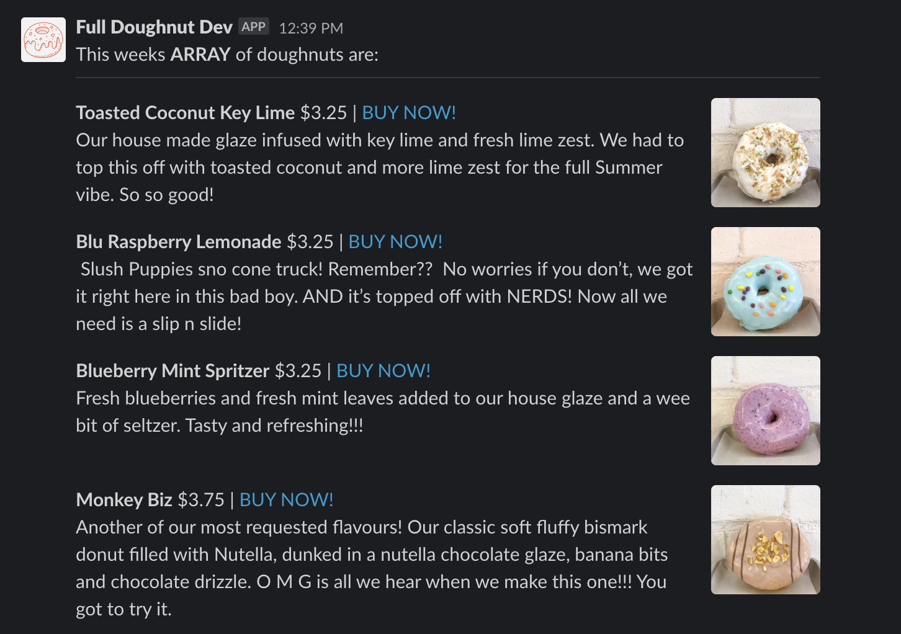

<div align="center">
  
</div>

<hr>

## What is Doughnuts Slack App? 🍩

This is a custom Slack application built to post weekly doughnuts to a channel of your choosing.

Using a node script we grab weekly doughnuts from [Boxcar Donuts](https://www.bxcrdonuts.ca/). 

Plugging into slack using webhooks and post the doughnuts in their [Block Kit](https://api.slack.com/block-kit).

```ts
{
  type: 'section',
  block_id: doughnut.id,
  text: {
    type: 'mrkdwn',
    text: `*${doughnut.name}* ${doughnut.price} | <${doughnut.url}| BUY NOW!> \n ${doughnut.description}`
  },
  accessory: {
    type: 'image',
    image_url: doughnut.imageUrl,
    alt_text: doughnut.name
  }
}
```

## Preview 
<div align="center">
  
</div>